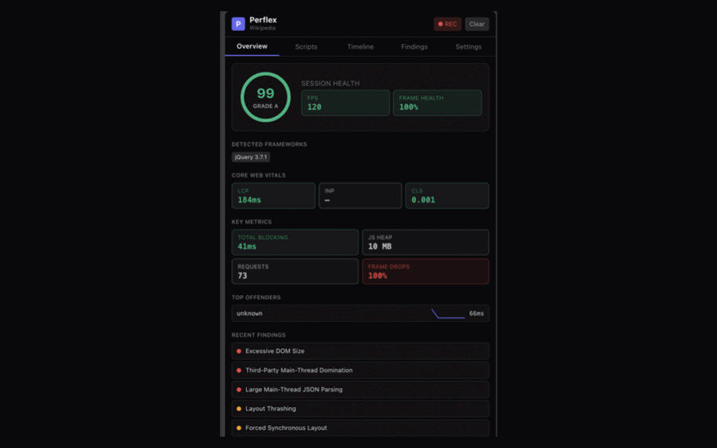
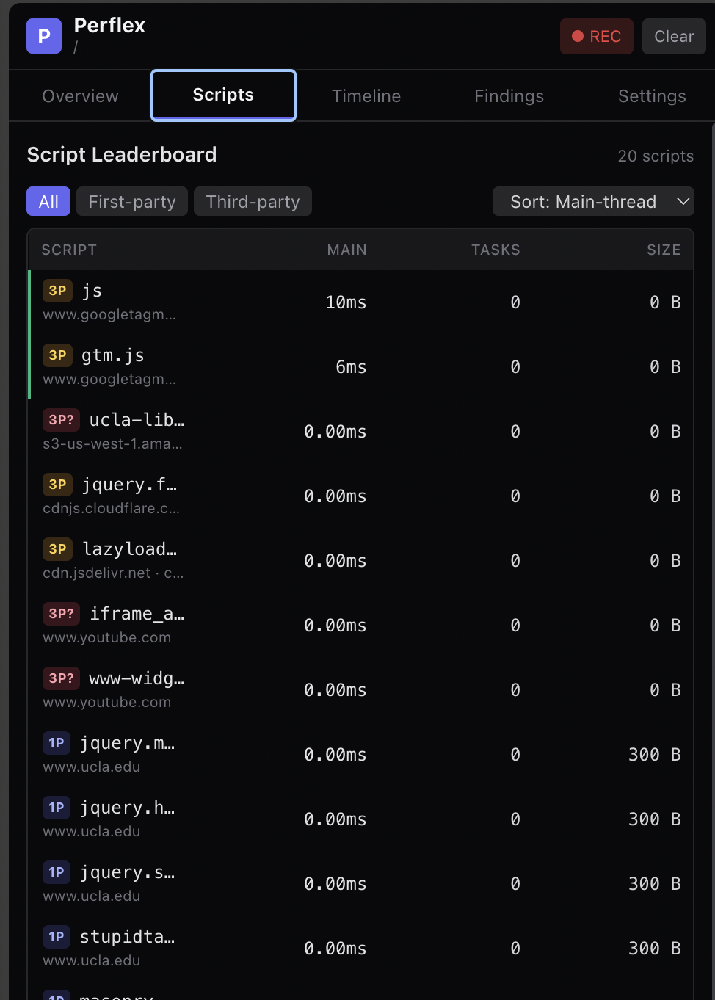
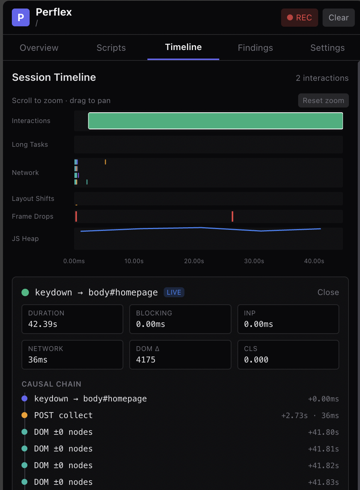
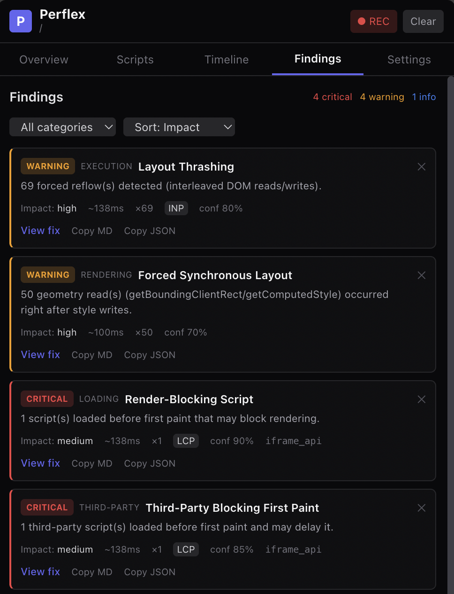
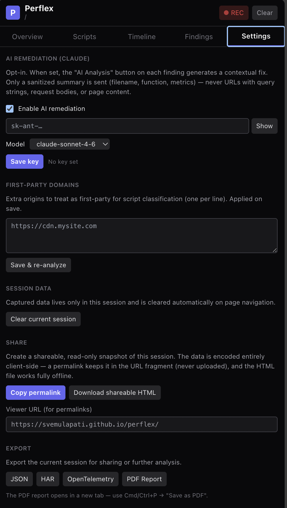

<div align="center">

# ⚡ Perflex

### The browser extension that tells you *which line of JavaScript* is making your site slow — and how to fix it.

**Real-time JavaScript performance profiler for Chrome with function-level attribution, 37 automatic anti-pattern detectors, and AI-powered, business-safe remediation.**

A free, open-source, privacy-first alternative to Lighthouse, the Chrome DevTools Performance panel, and commercial RUM (Sentry / Datadog / New Relic) — but focused on *attribution depth* and *actionable fixes*, right in your browser side panel.

[Install](#-install-in-60-seconds) · [Features](#-features) · [How it works](#-how-it-works) · [Why Perflex](#-perflex-vs-the-alternatives) · [Contributing](#-contributing)


</div>

---

> **TL;DR** — Open the side panel, use your site normally, and Perflex shows you a ranked leaderboard of the scripts and **functions** eating your main thread, a zoomable timeline of every interaction, and a queue of concrete performance fixes (with before/after code) that are safe for your UI and business logic. Optionally, ask Claude for a contextual fix on any finding.

## 🎯 What is Perflex?

Most performance tools tell you *that* your page is slow. Perflex tells you **exactly what to change.**

It's a Chrome (Manifest V3) extension that passively instruments a page — capturing network traffic, long tasks, layout thrashing, forced reflows, layout shifts, memory, and more — then attributes that cost down to the **originating script, function, and character position**. It pattern-matches your session against **37 known performance anti-patterns** and generates **remediation plans with before/after code, a risk level, and a "why this won't break your business logic" note.**

Everything runs **locally in your browser**. No account, no data leaves your machine (the optional AI feature sends only an anonymized, PII-free summary — and only if you add your own API key).

## ✨ Features

- 🔬 **Function-level attribution** — uses the **Long Animation Frames API** to pin main-thread time to a specific function and source location, not just "scripting."
- 🏆 **Script Leaderboard** — every script ranked by main-thread time, long tasks, transfer size, layout-shift contribution, and memory growth. Sortable, filterable (first-party vs third-party), expandable to per-function hotspots.
- 📊 **Core Web Vitals, live** — **LCP, INP, CLS**, TBT, FPS, JS heap, and a composite **0–100 health score** with an A–F grade.
- ⏱️ **Interaction timeline** — a zoomable, pannable **flame-chart-style timeline** (lanes for interactions, long tasks, network waterfall, layout shifts, frame drops, and memory) built on D3. Click any interaction to see its **causal chain**: `click → long task → fetch → DOM mutation → reflow → layout shift`.
- 🩺 **37 anti-pattern detectors** across Loading, Execution, Rendering, Network, Third-party, and **Framework** — layout thrashing, render-blocking scripts, synchronous XHR, redundant fetches, oversized/uncompressed payloads, unbounded list rendering, excessive DOM size, timer flooding, third-party main-thread domination, and more.
- ⚛️ **Framework-aware** — detects React, Vue, Angular, Next.js, Nuxt, Preact, and jQuery, and flags the costly mistakes: a **development build shipped to production** (reliably detected for React via the DevTools `bundleType`), **multiple UI frameworks** loaded on one page, and **outdated major versions**.
- 🛠️ **Business-safe remediation** — every finding ships with a fix: a one-line summary, before/after code diff, **risk level** (safe / verify / review), validation steps, and an explicit business-safety note.
- 🤖 **AI remediation (opt-in)** — bring your own **Claude API key** for contextual, code-specific fixes. Only a sanitized summary (filename + function + metrics) is ever sent — never URLs with tokens, request bodies, or page content.
- 🪶 **Near-zero overhead** — a self-monitoring **circuit breaker** measures Perflex's own cost and automatically throttles if it ever exceeds 2% of the frame budget.
- 🧩 **In-page overlay** — a draggable, Shadow-DOM-isolated HUD (`Ctrl+Shift+X`) showing live FPS, heap, long tasks, and throttle state on any page.
- 📤 **Export everything** — **JSON**, **HAR** (extended with a `_perflex` namespace), **OpenTelemetry/OTLP traces** (for Jaeger / Tempo / Datadog), and a printable **PDF report**. Plus "Copy as Markdown / JSON" for any finding (drop straight into a Jira / GitHub issue).
- 🔗 **Shareable permalinks** — share a read-only snapshot of a session as a **permalink** (the whole session is gzip-compressed into the URL fragment — never uploaded) or as a **self-contained HTML file** that opens offline with no extension or server.
- 🔒 **100% local & private** — no servers, no telemetry, no account.

## 📸 Screenshots

<div align="center">



*A quick tour — Overview · Scripts · Timeline · Findings · Settings*

</div>

| Script Leaderboard | Session Timeline |
|:---:|:---:|
|  |  |
| **Per-script & per-function attribution** | **Interaction causal chains** |

| Findings & Remediation | Settings |
|:---:|:---:|
|  |  |
| **37 detectors with business-safe fixes** | **AI remediation, sharing & export** |

## 🚀 Install in 60 seconds

> Perflex is currently distributed as an unpacked extension (Chrome Web Store listing coming soon).

```bash
git clone https://github.com/svemulapati/perflex.git
cd perflex
npm install
npm run build      # → produces dist/
```

Then load it:

1. Open `chrome://extensions`
2. Toggle **Developer mode** (top-right)
3. Click **Load unpacked** → select the `dist/` folder
4. Pin the ⚡ Perflex icon, open any page, and hit the icon (or `Ctrl+Shift+P`)

Works in **Chrome, Edge, Brave, Arc**, and other Chromium browsers. *(On Arc, the dashboard opens in a standalone window since Arc doesn't yet support the side-panel API.)*

## 🧭 Using it

1. **Open the side panel** and interact with your page normally (click, scroll, navigate).
2. **Overview** → health score, Core Web Vitals, top offenders.
3. **Scripts** → the leaderboard; click a row to see its hottest functions.
4. **Timeline** → scroll to zoom, drag to pan; click an interaction for its causal chain.
5. **Findings** → ranked issues; click **View fix** for the remediation, **Copy MD** to paste into a ticket, or **AI Analysis** for a contextual fix.
6. **Settings** → add a Claude API key, set first-party domains, and **export** the session.

> Press **`Ctrl+Shift+X`** on any page to toggle the live in-page overlay.

### 🔗 Sharing a session

In **Settings → Share** you can:

- **Copy permalink** — encodes the session into a URL fragment pointing at a static viewer. The fragment is decoded entirely in the recipient's browser; **nothing is ever uploaded**. The viewer ships in this repo at `docs/` — enable **GitHub Pages → Deploy from branch → `/docs`** and set the *Viewer URL* in Settings to your Pages URL (default `https://svemulapati.github.io/perflex/`).
- **Download shareable HTML** — a single self-contained `.html` file with the session inlined; it opens in any browser fully offline, no extension or server required. Great for attaching to a ticket.

## 🆚 Perflex vs the alternatives

| | **Perflex** | Lighthouse | DevTools Perf panel | Sentry / Datadog RUM |
|---|:---:|:---:|:---:|:---:|
| Runs live in the browser | ✅ | ⚠️ lab run | ✅ | ✅ |
| Function-level attribution | ✅ | ❌ | ⚠️ manual | ❌ |
| 37 automatic anti-pattern detectors | ✅ | ⚠️ subset | ❌ | ⚠️ subset |
| Concrete before/after fix + risk level | ✅ | ⚠️ generic | ❌ | ❌ |
| AI-generated contextual remediation | ✅ | ❌ | ❌ | ⚠️ paid |
| Interaction causal chains | ✅ | ❌ | ⚠️ manual | ⚠️ |
| Free & open source | ✅ | ✅ | ✅ | ❌ |
| 100% local / no account | ✅ | ✅ | ✅ | ❌ |
| Export HAR / OpenTelemetry / PDF | ✅ | ⚠️ JSON | ⚠️ | ✅ |

Perflex isn't trying to replace your RUM in production — it's the tool you reach for *while developing or debugging* to find the exact code to change.

## 🧠 How it works

Six layers, designed so measurement never contaminates the page or the main thread:

```
 Page (MAIN world)                 Extension (privileged)
┌──────────────────────┐          ┌────────────────────────────────────┐
│  Collector (IIFE)    │  window  │  Bridge (content, ISOLATED world)  │
│  • PerformanceObserver│ postMsg  │  relays events to the background   │
│  • fetch / XHR hooks  │ ───────► └─────────────┬──────────────────────┘
│  • timers / reflow    │                        │ chrome.runtime
│  • layout thrashing   │                        ▼
│  • circuit breaker    │          ┌────────────────────────────────────┐
└──────────────────────┘          │  Service worker (per-tab buffer)   │
   injected via                   └─────────────┬──────────────────────┘
   chrome.scripting                             │ Port
   (CSP-proof)                                  ▼
                                   ┌────────────────────────────────────┐
                                   │  Side panel (React)                │
                                   │  • Correlator + Analyzer (Worker)  │
                                   │  • Overview / Scripts / Timeline / │
                                   │    Findings / Settings             │
                                   └────────────────────────────────────┘
```

1. **Collector** — captures everything in the page's MAIN world with a fixed-size ring buffer and stack **fingerprinting** (FNV-1a hash, never full stack strings in the hot path).
2. **Correlator** (Web Worker) — fuses events into per-script / per-function profiles, Core Web Vitals, and interaction sessions.
3. **Analyzer** (Web Worker) — runs the 30 anti-pattern matchers.
4. **Remediation** — template fixes for every pattern, plus optional Claude API.
5. **Reporter** — the React side panel + in-page overlay.
6. **Export** — JSON / HAR / OpenTelemetry / PDF.

All heavy lifting happens off the main thread in a worker, so Perflex's own measurements stay clean.

### Tech stack

`Manifest V3` · `TypeScript (strict)` · `React 18` · `Vite + CRXJS` · `Zustand` · `Web Workers` · `D3` · `Tailwind CSS` · `Vitest` · `Claude API`

## 🛠️ Development

```bash
npm run dev          # Vite dev server (HMR for the panel/popup)
npm test             # Vitest unit suite
npm run typecheck    # strict TypeScript, no emit
npm run build        # production build → dist/
```

> The MAIN-world collector is bundled separately as a self-contained IIFE. After editing anything in `src/content/collector/`, run a full `npm run build` (which runs `npm run build:collector`).

```
src/
├── content/          # collector (MAIN world) + bridge + overlay
├── workers/          # correlator + analyzer
├── shared/           # types, anti-patterns, remediation templates, exporters, AI client
├── panel/            # React side panel (Overview / Scripts / Timeline / Findings / Settings)
├── popup/            # quick-glance popup
└── background/       # service worker (routing + CSP-proof injection)
```

## ⚡ Performance overhead

Perflex is built to be invisible: target **<0.5ms per event**, a bounded memory footprint, and a **circuit breaker** that throttles collection if its own cost exceeds 2% of the frame budget (and drops to a minimal mode above 5%). A ⚠️ badge on the toolbar icon indicates when it's throttling.

## ❓ FAQ

**Does my data leave my browser?** No. Everything is processed locally. The optional AI feature sends only an anonymized, PII-stripped summary, and only when you click "AI Analysis" with your own API key configured.

**Will it slow down the page I'm profiling?** It's designed not to — see [overhead](#-performance-overhead). The circuit breaker is your safety net.

**Does it work on sites with a strict Content-Security-Policy?** Yes — the collector is injected via `chrome.scripting` in the MAIN world, which bypasses page CSP.

**Is it a replacement for Lighthouse / RUM?** No — it's complementary. Use Lighthouse for lab scores and RUM for production monitoring; use Perflex to find the exact code to fix.

## 🤝 Contributing

Contributions are very welcome — new anti-pattern detectors, remediation templates, and UI polish especially.

1. Fork & clone
2. `npm install && npm test`
3. Add your change (anti-patterns live in `src/shared/anti-patterns/`, each with a remediation in `src/shared/remediation-templates.ts`)
4. `npm run typecheck && npm test && npm run build`
5. Open a PR

Found a site where Perflex misbehaves or misses an issue? **[Open an issue](https://github.com/svemulapati/perflex/issues)** — real-world repro cases are gold.

## 🗺️ Roadmap

- [ ] Chrome Web Store listing
- [ ] DevTools panel integration
- [ ] Firefox / Safari support
- [ ] Coverage-API-backed unused-JS detection
- [x] Shareable session permalinks (URL-fragment encoded + offline HTML)
- [x] Framework-aware detectors (React/Vue/Angular/Next/Nuxt/jQuery)

## 📄 License

[MIT](LICENSE) © Perflex contributors. Free to use, fork, and ship.

---

<div align="center">

**If Perflex helped you find a slow function, please ⭐ star the repo — it genuinely helps others discover it.**

<sub>web performance · javascript profiler · chrome extension · manifest v3 · core web vitals · LCP · INP · CLS · long tasks · layout thrashing · forced reflow · flame chart · main thread · devtools · lighthouse alternative · RUM · performance monitoring · web vitals · frontend performance · bundle analysis · third-party scripts · AI code review · performance optimization</sub>

</div>
